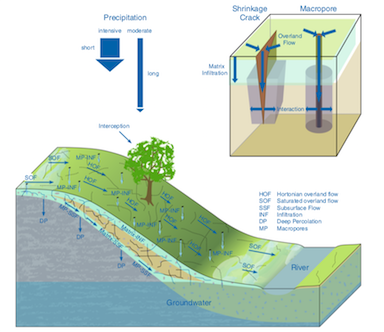

<p align="center">

</p>

<p align="center">
<i>Runoff Generation Research in Pure Python</i>
</p>

Roger, *Runoff Generation Research*, is a process-based hydrologic model that supports anything between plot and catchment scale. Roger is written in pure Python, which facilitates model setup workflows.

*We want to enable high-performance hydrologic modelling with a clear focus on flexibility and usability.*

Roger supports a NumPy backend for small-scale problems, and a
high-performance [JAX](https://github.com/google/jax) backend
with CPU and GPU support. It is fully parallelized via MPI and supports
distributed execution on any number of nodes, including multi-GPU architectures (see also ...).

To learn more about Roger, make sure to [visit our documentation](https://roger.readthedocs.io/en/latest/).

## Features

Roger provides

-   support for grid-based **SVAT models and distributed models**
-   **offline solute transport** with several **StorAge selection (SAS) functions**
-   support for both **matrix-driven (Green-Ampt) and gravity driven infiltration (Viscous-Flow)**
-   several **pre-implemented diagnostics** such as hydrologic fluxes,
    variable time aggregation, travel time distributions and residence time
    distributions (written to netCDF4 output)
-   **pre-configured idealized and realistic set-ups** that are ready to
    run and easy to adapt
-   **accessibility and extensibility** - thanks to the
    power of Python!

## Installation and usage on Mac
Some instructions how to use the model from the repository. Please ensure that
Anaconda is installed (i.e. Python distribution). You can install it from
https://www.anaconda.com/products/individual.

The repository is still in development. Please update your local repository
regularly by using the `git pull` command.

GIT:

**First step:**
```bash
git clone https://github.com/schwemro/roger.git
cd roger
conda env create -f conda-environment.yml
```
**Second step:**
Activate the anaconda environment and launch Spyder
```bash
conda activate roger
spyder
```

## Installation and usage on Windows
Some instructions how to use the model from the repository. Please ensure that
Anaconda is installed (i.e. Python distribution). You can install it from
https://www.anaconda.com/products/individual.

The repository is still in development. Please update your local repository
regularly by using the `git pull` command.

GIT:

**First step:**
```bash
git clone https://github.com/schwemro/roger.git
cd roger
conda env create -f conda-environment.yml
```
**Second step:**
Activate the anaconda environment and launch Spyder
```bash
activate roger
spyder
```

**Third step:**
Run a test case. Navigate to `roger/setups/xxx`.

## Basic usage

To run Roger, you need to set up a model --- i.e., specify which settings
and model domain you want to use. This is done by subclassing the
`RogerSetup` base class in a *setup script* that is written in Python. You
should use the `roger copy-setup` command to copy one into your current
folder. A good place to start is the
[SVAT model](https://github.com/team-ocean/roger/blob/master/roger/setups/svat/svat.py):

```bash
$ roger copy-setup svat
```

After setting up your model, all you need to do is call the `setup` and
`run` methods on your setup class. The pre-implemented setups can all be
executed via `roger run`:

```bash
$ roger run svat.py
```

For more information on using Roger, have a look at [our
documentation](http://roger.readthedocs.io).

## Contributing

Contributions to Roger are always welcome, no matter if you spotted an
inaccuracy in [the documentation](https://roger.readthedocs.io), wrote a
new setup, fixed a bug, or even extended Roger\' core mechanics. There
are 2 ways to contribute:

1.  If you want to report a bug or request a missing feature, please
    [open an issue](https://github.com/schwemro/roger/issues). If you
    are reporting a bug, make sure to include all relevant information
    for reproducing it (ideally through a *minimal* code sample).
2.  If you want to fix the issue yourself, or wrote an extension for
    Roger - great! You are welcome to submit your code for review by
    committing it to a repository and opening a [pull
    request](https://github.com/schwemro/toger/pulls). However,
    before you do so, please check [the contribution
    guide](http://roger.readthedocs.io/quickstart/get-started.html#enhancing-Roger)
    for some tips on testing and benchmarking, and to make sure that
    your modifications adhere with our style policies. Most importantly,
    please ensure that you follow the [PEP8
    guidelines](https://www.python.org/dev/peps/pep-0008/), use
    *meaningful* variable names, and document your code using
    [Google-style
    docstrings](http://sphinxcontrib-napoleon.readthedocs.io/en/latest/example_google.html).

## How to cite

If you use Roger in scientific work, please consider citing [the following publication](...):

```bibtex
@article{...,
	title = {Roger v0.1 – Runoff Generation Research in pure {Python}},
	volume = {...},
	issn = {...},
	url = {...},
	doi = {...},
	number = {...},
	journal = {...},
	author = {Schwemmle, Robin and Weiler, Markus},
	month = ...,
	year = {...},
	pages = {...},
}
```

Or have a look at [our documentation](https://roger.readthedocs.io/en/latest/more/publications.html)
for more publications involving Roger.

### Description of land use (lu_id)
- `0`: sealed surface
- `5`: arable land
- `501`: bean
- `502`: amaranth
- `503`: other commercial crops
- `504`: artichoke
- `505`: berry
- `506`: ornamental plant
- `507`: nettle
- `508`: buckwheat
- `509`: pea
- `510`: strawberry
- `511`: esparcet
- `512`: sunflower
- `513`: vegetables
- `514`: flax
- `515`: early potatoes
- `516`: fodder root crops
- `517`: fodder legumes
- `518`: hemp
- `519`: home garden
- `520`: hop
- `521`: legumes
- `522`: intensive fruit-growing
- `523`: potato
- `524`: clover
- `525`: grain corn
- `526`: herbs
- `527`: false flax
- `528`: lentil
- `529`: lupine
- `530`: lucerne
- `531`: summer phacelia
- `532`: flat pea
- `533`: grape
- `534`: grape school
- `535`: rhubarb
- `536`: beetroot
- `537`: nuts
- `538`: summer mustard
- `539`: silage corn
- `540`: silphium
- `541`: soybean
- `542`: summer barley
- `543`: summer wheat
- `544`: summer oat
- `545`: summer rape
- `546`: summer triticale
- `547`: sunflower
- `548`: other fruit-growing
- `549`: sorghum
- `550`: asparagus
- `551`: orchards
- `552`: sweet potato
- `553`: tobacco
- `554`: helianthus
- `555`: vetch
- `556`: winter barley
- `557`: winter wheat
- `558`: winter oat
- `559`: winter rape
- `560`: winter triticale
- `561`: chicory
- `562`: sweet corn
- `563`: sugar beet
- `564`: winter green manure (Oct)
- `565`: summer grass
- `566`: winter grass
- `567`: clover
- `568`: winter phacelia
- `569`: winter green manure (Aug)
- `570`: winter green manure (Sep)
- `571`: summer grass (growing only)
- `572`: winter grass (growing only)
- `573`: summer grass (continued)
- `574`: winter grass (continued)
- `598`: no crop
- `599`: bare
- `6`: vineyard
- `7`: fruits
- `8`: grass
- `9`: complex parcel
- `10`: deciduous forest
- `11`: mixed forest
- `12`: coniferous forest
- `13`: wetland
- `14`: lake
- `15`: forest (unknown tree species)
- `16`: urban tree
- `20`: river
- `31`: gravel rooftop
- `32`: grass rooftop extensive
- `33`: grass rooftop intensive
- `41`: gravel
- `50`: percolation plant
- `98`: grass intensive
- `100`: urban
- `999`: no value

## TODO
- implement runoff and channel routing (e.g. kinematic wave or hydraulic approach)
- implement RoGeR-Urban
- implement distributed model with run-on infiltration
- implement online-coupled solute transport
- use coarser spatial and temporal resolution for computation of
groundwater-related processes
- implement baseflow in the groundwater routine. requires surface water depth.
- add equations to docstrings
- write documentation for readthedocs (see `docs/`)

## License
This software can be distributed freely under the MIT license. Please read the LICENSE for further information.
© 2022, Robin Schwemmle (<robin.schwemmle@hydrology.uni-freiburg.de>)
